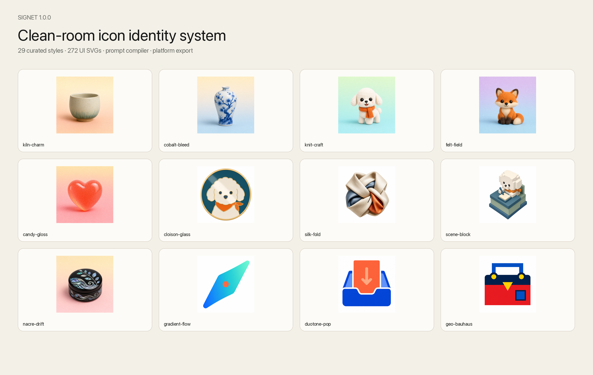
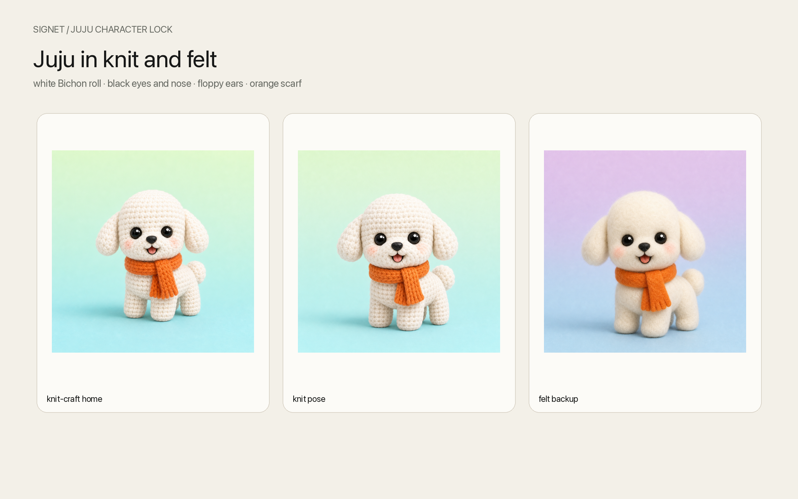
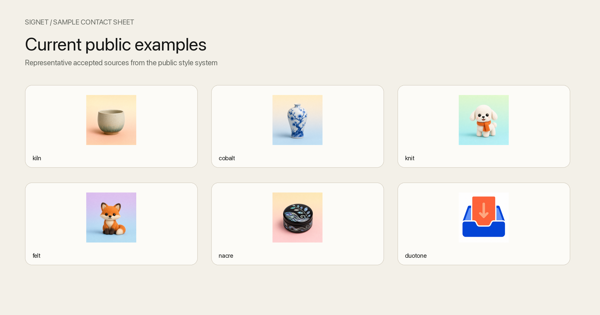
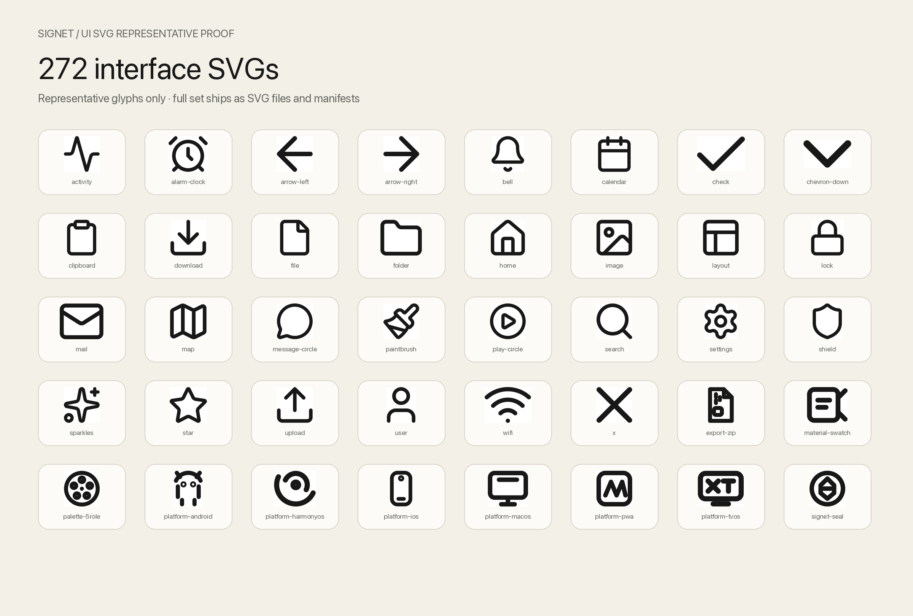
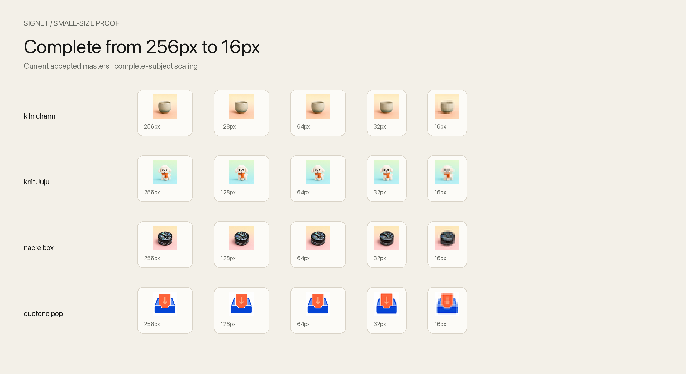
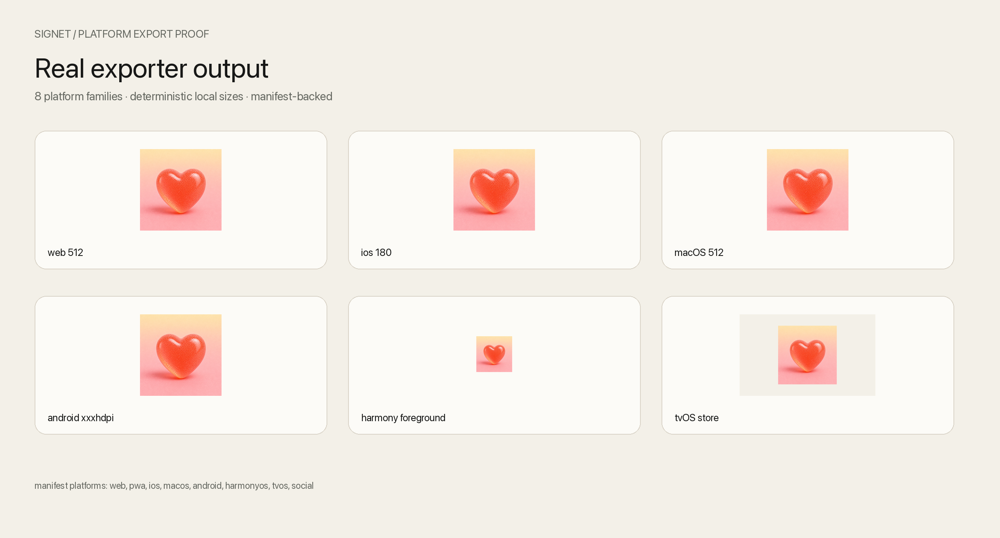

# Signet Icon System

<p align="center">
  <a href="README.md">中文</a> · <a href="README.en.md">English</a>
</p>

<p align="center"><strong>Stamp one visual identity across every icon surface.</strong></p>



<p align="center">
  <code>29 curated styles</code> · <code>272 UI SVGs</code> · <code>8 export targets</code> · <code>Apache-2.0</code>
</p>

Signet is a clean-room icon identity system. It compiles a product brief into an executable visual contract for material, silhouette, lighting, composition, palette, and batch consistency. Once a master passes the quality gates, Signet exports production assets for Web, PWA, iOS, Android, macOS, HarmonyOS, tvOS, and social media.

Release count / 发布计数：门面 19 · 编辑 6 · 旗舰 1 · 扁平 3 · 合计 29. See the [self-contained Gallery](docs/gallery.html) and [STYLE_LEDGER](docs/STYLE_LEDGER.md) for the complete 29-style set.

## Why Signet

| Problem | Signet's answer |
|---|---|
| An icon set looks assembled from unrelated templates | Style recipes and batch locks align material, camera, lighting, and silhouette |
| Brand-color changes make the image muddy | Role-based palettes and luminance gates preserve first-glance clarity |
| A large image looks good but fails at product size | 64px / 32px / 16px checks cover silhouette, edges, and contrast |
| One master needs manual work for every platform | One command exports eight platform families, manifests, previews, and an optional zip |
| The interface also needs a coherent line-icon set | 250 themed + 22 custom glyphs provide 272 UI SVGs |

## Start in 30 seconds

```bash
git clone https://github.com/dososo/blcaptain-signet.git
cd blcaptain-signet
python -m pip install pyyaml Pillow pytest
```

Compile the included brief into an icon prompt:

```bash
python skills/signet/scripts/build_prompt.py \
  examples/flowpilot.brief.yaml \
  --style kiln-charm \
  --out /tmp/flowpilot-kiln.prompts.md
```

Preflight a 1024×1024 PNG master and export platform assets:

```bash
python skills/signet/scripts/preflight_icon_set.py examples/sample-master.png --json

python skills/signet/scripts/export_icon_assets.py \
  examples/sample-master.png \
  --out /tmp/signet-export \
  --name "FlowPilot" \
  --platforms web,pwa,ios,macos,android,harmonyos,tvos,social \
  --brand-primary "#2758D8" \
  --ios-bg "#F3F0E8" \
  --zip
```

Signet compiles the visual contract, validates the master, and exports the assets. Image generation stays with the model of your choice.

## Public showcase

The README shows selected, readable proofs only. The full 29-board collection lives in [Gallery](docs/gallery.html), so GitHub's front page does not compress the system into unreadable thumbnails.

<table>
  <tr>
    <td width="50%"></td>
    <td width="50%"></td>
  </tr>
</table>

## 29 visual styles

| Category | Count | Use |
|---|---:|---|
| Facade | 19 | Brand icons, feature icons, and high-recognition objects |
| Editorial | 6 | Empty states, editorial illustrations, feature explanations, and brand storytelling |
| Flagship | 1 | `nacre-drift`, a high-recognition black-lacquer and mother-of-pearl craft |
| Flat | 3 | Compact, high-contrast, graphic interface contexts |

Every public board uses complete-subject presentation, not cropped horizontal strips. Open [docs/gallery.html](docs/gallery.html) for the full set.

## 272 UI SVGs



The UI track contains **250 themed + 22 custom = 272 SVGs**, normalized to `24×24 / 2px / round cap / round join / currentColor`. Coverage includes navigation, actions, status and feedback, communication, media and devices, files and data, commerce, security, platforms, and Signet tools.

The model is “deep essentials + generated on demand.” Missing glyphs can be added through parametric geometry in `skills/signet/ui/param_engine.py`. UI line icons do not use imagegen; inline the SVG in the frontend and drive `currentColor` with CSS `color`.

## Small-size proof and platform delivery

<table>
  <tr>
    <td width="50%"></td>
    <td width="50%"></td>
  </tr>
</table>

Preflight checks silhouette, safe edges, alpha, contrast, and small-size behavior. The exporter builds platform size ladders, adaptive variants, preview sheets, manifests, and an optional zip.

## Workflow

```text
Product brief
   ↓
Choose one of 29 styles + brand color
   ↓
Compile the visual contract and batch prompts
   ↓
Generate a 1024×1024 master with your image model
   ↓
Preflight silhouette / contrast / edges / consistency
   ↓
Export Web / PWA / iOS / Android / macOS / HarmonyOS / tvOS / Social
```

Primary entry points:

- `build_prompt.py` — compile one brief.
- `build_batch_prompts.py` — compile a project set with consistency locks.
- `preflight_icon_set.py` — validate master images.
- `export_icon_assets.py` — produce platform sizes, variants, manifests, and zip files.
- `ui_pipeline.py` — merge, validate, and export UI SVGs.

## Verification

```bash
python -m pytest -q
python skills/signet/ui/repo_license_gate.py
python scripts/prepush_check.py --git-tree release/github-public-v1.0
```

The release gate verifies Apache-2.0 and third-party notices, pytest, the public file allowlist, process-data leakage, credentials, personal information, README images, external Gallery resources, the 29-style count, the Git tree, a single-root-commit public history, and per-file SHA-256 hashes.

## Public tree

```text
assets/                 Public reference boards and examples
docs/                   Gallery and the 29-style ledger
examples/               Runnable briefs and a master sample
skills/signet/          Skill, 29 recipes, compiler, gates, exporter, and UI SVGs
scripts/prepush_check.py
tests/                  Public product regression tests
RELEASE_MANIFEST.md     Release tree and per-file SHA-256
```

## FAQ

<details>
<summary><strong>Does Signet call an image model?</strong></summary>

No. Signet compiles prompts and visual constraints. You can send the result to any image-generation model you choose.
</details>

<details>
<summary><strong>Can I use the UI SVG track on its own?</strong></summary>

Yes. The UI SVGs are independent, use `currentColor`, and are designed for direct frontend use.
</details>

<details>
<summary><strong>Can I use Signet commercially?</strong></summary>

Project code, documentation, style recipes, and original metadata are Apache-2.0. Third-party UI glyph licenses and notices are documented in `LICENSES.md`. Generated images remain subject to your model provider's terms and your own trademark and brand-clearance review.
</details>

## Author

Created and maintained by **爆裂队长NEXT**.

- GitHub: [@dososo](https://github.com/dososo)
- X: [@thinkszyg](https://x.com/thinkszyg)
- Work email: [blteam2026@outlook.com](mailto:blteam2026@outlook.com)
- Issues: [dososo/blcaptain-signet Issues](https://github.com/dososo/blcaptain-signet/issues)

## Contributing

Read [CONTRIBUTING.md](CONTRIBUTING.md) and [CLEAN_ROOM.md](CLEAN_ROOM.md) before submitting a change. Do not copy third-party prompts, assets, screenshots, compositions, naming sets, or visual identities.

## License

Apache License 2.0. See [LICENSE](LICENSE), [NOTICE.md](NOTICE.md), and [LICENSES.md](LICENSES.md).
